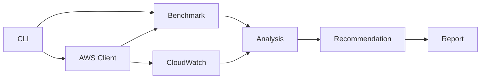

# LambdaOpt: SLO-aware cost optimizer for AWS Lambda

[](https://github.com/Mike-Animal-Counseling/aws-lambda-slo-optimizer/actions/workflows/ci.yml)

[](LICENSE)
<!-- PyPI badge can be enabled after the package is published:
[](https://pypi.org/project/aws-lambda-slo-optimizer/)
-->

Find the cheapest AWS Lambda configuration that meets your p95/p99 latency SLO.

LambdaOpt is a production-oriented CLI for evaluating AWS Lambda performance, cost, and operational risk. It benchmarks candidate configurations, estimates Lambda cost, computes latency percentiles and SLO violation rate, analyzes CloudWatch production metrics, detects cold-start-driven tail latency from logs when available, and recommends safe next actions. It defaults to dry-run behavior and no production mutation.

## Current Release

Current release: `v0.1.0 beta`.

This beta is intended for local evaluation, report generation, read-only AWS analysis, current-config benchmarking, and non-production smoke testing. It is not an automatic production mutation system.

## What LambdaOpt Does

- Benchmarks candidate configurations from local files or separate mapped test functions.
- Estimates Lambda request, compute, and provisioned concurrency cost.
- Computes mean, p50, p95, p99, standard deviation, and SLO violation rate.
- Detects cold-start-driven tail latency using CloudWatch Logs REPORT lines when available.
- Analyzes CloudWatch production metrics for duration, invocations, errors, throttles, and concurrency.
- Computes Pareto frontiers and recommends the cheapest SLO-satisfying configuration.
- Recommends safe next actions such as benchmarking, investigating throttles, testing arm64, or testing provisioned concurrency.
- Defaults to dry-run workflows and does not mutate production Lambda configuration.

## Architecture



The AWS layer is isolated from the optimizer. Benchmark data, CloudWatch metrics, and cold-start signals are converted into typed domain models before recommendation logic runs.

## Quickstart

Install from PyPI:

```bash
pip install aws-lambda-slo-optimizer
```

Install from source for development:

```bash
git clone https://github.com/Mike-Animal-Counseling/aws-lambda-slo-optimizer.git
cd aws-lambda-slo-optimizer
python -m venv .venv
source .venv/bin/activate
python -m pip install -e ".[dev,aws,charts]"
```

Run a synthetic workload with no AWS credentials:

```bash
lambdaopt simulate --workload cpu-bound --p95 500 --monthly-requests 1000000 --output reports/cpu
```

Tune from local benchmark results:

```bash
lambdaopt tune --input examples/sample_results.json --p95 500 --monthly-requests 1000000 --output reports/sample
```

Plan a benchmark from read-only Lambda metadata:

```bash
lambdaopt plan my-function --p95 500 --region us-east-1 --profile default
```

Benchmark the currently deployed configuration:

```bash
lambdaopt bench my-function --trials 50 --payload examples/payload.json --region us-east-1 --output reports/bench-current
```

Analyze CloudWatch metrics and cold-start logs:

```bash
lambdaopt analyze my-function --window 24h --p95 500 --region us-east-1 --include-logs --output reports/analyze
```

Run a dry-run controller evaluation:

```bash
lambdaopt watch my-function --p95 500 --window 15m --dry-run --region us-east-1
```

Check local and AWS readiness before benchmarking:

```bash
lambdaopt doctor my-function --region us-east-1 --include-logs
```

Generate least-privilege IAM policy JSON:

```bash
lambdaopt iam generate --mode analyze-with-logs --function my-function --region us-east-1 --account-id 123456789012
```

## Sample Output

```text
Recommendation: 1024MB arm64 for p95 <= 500ms (90% confidence).
Reports written to reports/sample
```

Generated report files include:

- `optimization_report.md`
- `benchmark_results.json`
- `recommended_config.json`
- `cost_vs_p95.png` when matplotlib is installed and chart generation succeeds

## Safety

LambdaOpt is conservative by design:

- No production mutation by default.
- No current command changes `$LATEST`, published versions, production aliases, memory, architecture, or provisioned concurrency.
- Candidate comparison benchmarks separate test functions from an explicit mapping file.
- The watch controller is dry-run and emits recommended test actions, not direct infrastructure changes.
- Guardrails prioritize error and throttle investigation before cost optimization.
- Payload helpers redact likely sensitive keys such as `password`, `token`, `secret`, `authorization`, and `api_key`.
- AWS and validation errors are summarized for users; traceback is available with `--debug`.

Read more in [docs/safety.md](docs/safety.md).

## Security Model

LambdaOpt uses the boto3 credential provider chain and never asks for AWS access keys. Prefer AWS profiles, SSO, or IAM roles, and avoid broad policies such as `AdministratorAccess`. Current AWS workflows are read-only for configuration; benchmark commands can invoke approved functions and should be scoped accordingly. Use `lambdaopt iam generate` to create least-privilege policy JSON for each usage mode.

LambdaOpt does not dump raw environment variables, does not serialize boto3 credential objects, and redacts likely sensitive payload/report values before writing logs or reports. Generated reports are local files and do not include raw benchmark payload contents by default.

## Check Your Environment With `lambdaopt doctor`

Use `doctor` before real AWS benchmarking or analysis to verify local setup, region/profile resolution, Lambda metadata access, CloudWatch permissions, and optional CloudWatch Logs access:

```bash
lambdaopt doctor my-function --region us-east-1
lambdaopt doctor my-function --region us-east-1 --include-logs
```

`doctor` does not invoke Lambda functions and does not mutate AWS resources.

## Generate Least-Privilege IAM Policy

Generate a scoped IAM policy for the LambdaOpt workflow you want to run:

```bash
lambdaopt iam generate --mode analyze-with-logs --function my-function --region us-east-1 --account-id 123456789012
```

If `--account-id` is omitted, LambdaOpt can infer it with STS `GetCallerIdentity` through the standard boto3 provider chain. Generated policies do not include `AdministratorAccess` or Lambda mutation actions.

## No AWS Credentials In CI

GitHub Actions runs format checks, linting, mypy, pytest, security regression tests, and package build using mocks and local fixtures only. CI does not require AWS credentials and must not reference `AWS_ACCESS_KEY_ID`, `AWS_SECRET_ACCESS_KEY`, or `AWS_SESSION_TOKEN`.

## No Production Mutation By Default

Production mutation is intentionally out of scope for the current beta. LambdaOpt does not update function memory, architecture, timeout, aliases, versions, or provisioned concurrency. Benchmark commands may invoke approved functions, so use non-production functions or explicit candidate mappings for first runs.

## Security and IAM

See [docs/security.md](docs/security.md) and [docs/iam-permissions.md](docs/iam-permissions.md) for command-level permissions and copy-pasteable IAM policy examples.

For a safe first real-AWS validation path, see the [AWS smoke test guide](docs/smoke-test.md). It uses a sandbox or non-production Lambda function and does not require administrator permissions.

## Lambda Power Tuning Comparison

AWS Lambda Power Tuning focuses on memory and power tradeoffs by running controlled benchmarks across Lambda memory sizes. LambdaOpt is complementary. It focuses on production SLO-constrained deployment recommendations using benchmark results, CloudWatch metrics, cold-start signals, cost estimates, and dry-run operational guardrails.

Use Lambda Power Tuning when you want a Step Functions-driven memory benchmark. Use LambdaOpt when you want a conservative recommendation workflow that asks whether a configuration satisfies p95/p99 latency goals at the lowest estimated cost and with acceptable operational risk.

## Documentation

- [Installation](docs/installation.md)
- [Usage](docs/usage.md)
- [Architecture](docs/architecture.md)
- [Candidate Benchmarking](docs/candidate-benchmarking.md)
- [Design](docs/design.md)
- [Safety](docs/safety.md)
- [Security](docs/security.md)
- [IAM Permissions](docs/iam-permissions.md)
- [AWS Smoke Test](docs/smoke-test.md)
- [CloudWatch Analysis](docs/cloudwatch-analysis.md)
- [Cost Model](docs/cost-model.md)
- [Cold Start Analysis](docs/cold-start-analysis.md)
- [Dashboard](docs/dashboard.md)
- [Release Checklist](docs/release.md)
- [PyPI Release](docs/pypi-release.md)
- [Roadmap](docs/roadmap.md)

## Development

```bash
make install
make check
```

CI runs Ruff format check, Ruff lint, mypy, pytest, and package build.

## Verify Locally Before Pushing

Run the same core checks locally before pushing:

```bash
make check
python -m pytest
python -m build
```

`make check` runs formatting checks, linting, type checking, tests, and package build. Pytest is configured to keep temporary files under `.pytest-tmp-root` so local runs do not depend on the operating system temp directory.

## CI Expectations

GitHub Actions uses mocked or stubbed AWS calls only. No AWS credentials or AWS secrets are required in CI, and CI must not run real AWS integration tests. Real AWS smoke tests should be run manually and locally against explicitly approved functions, profiles, and regions.

The PyPI publishing workflow uses Trusted Publishing and does not store PyPI API tokens or AWS credentials.

## Known Limitations

- No production mutation by default.
- Benchmarking different configurations requires candidate test functions or future alias-based workflows.
- CloudWatch percentile availability may vary by traffic volume and metric query behavior.
- Cold-start analysis depends on CloudWatch Logs access and log completeness.
- Cost estimates are approximate and configurable.

## Status

LambdaOpt is a `v0.1.0` production beta. The local optimizer, simulator, report generation, read-only AWS metadata planning, current-config benchmarking, separate test-function candidate benchmarking, CloudWatch analysis, cold-start analysis, provisioned concurrency recommendation, architecture comparison, and dry-run controller are implemented and tested. Production mutation remains intentionally out of scope.

## Roadmap

Near-term milestones include safer alias-based benchmark workflows, richer SLO policy configuration, dashboard export, release automation, and more detailed pricing configuration. See [docs/roadmap.md](docs/roadmap.md).

## License

MIT. See [LICENSE](LICENSE).
