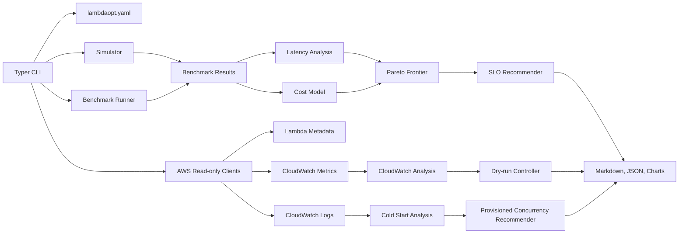

# LambdaOpt

LambdaOpt is an SLO-aware AWS Lambda deployment optimizer that helps find the cheapest safe configuration that satisfies p95 and p99 latency goals.

It combines benchmark results, CloudWatch metrics, CloudWatch Logs cold-start signals, Lambda pricing estimates, Pareto frontier analysis, and conservative recommendations. The project is designed for production-minded teams that care about both latency and cost, not just raw speed.

## Value Prop

Lambda memory tuning usually answers one question: "which configuration is fastest or cheapest in a benchmark?" LambdaOpt asks a slightly stricter question:

> What is the cheapest configuration that still satisfies my latency SLO with acceptable operational risk?

LambdaOpt can:

- Simulate workloads locally without AWS credentials.
- Tune from local benchmark files.
- Benchmark separate candidate test functions without mutating production.
- Read Lambda metadata and CloudWatch metrics.
- Detect cold-start-driven tail latency from REPORT logs.
- Estimate on-demand and provisioned concurrency cost.
- Recommend memory, architecture, and provisioned concurrency tests.
- Run a dry-run controller that recommends actions without changing infrastructure.

## Architecture



## Installation

```bash
git clone https://github.com/Mike-Animal-Counseling/aws-lambda-slo-optimizer.git
cd aws-lambda-slo-optimizer
python -m venv .venv
source .venv/bin/activate
python -m pip install -e ".[dev,aws,charts]"
```

On Windows PowerShell:

```powershell
py -3.11 -m venv .venv
.\.venv\Scripts\Activate.ps1
python -m pip install -e ".[dev,aws,charts]"
```

More details: [docs/installation.md](docs/installation.md)

## Quickstart

Run a local simulation:

```bash
lambdaopt simulate --workload cpu-bound --p95 500 --monthly-requests 1000000 --output reports/cpu
```

Tune from sample benchmark results:

```bash
lambdaopt tune --input examples/sample_results.json --p95 500 --monthly-requests 1000000 --output reports/sample
```

Plan candidate configs from read-only Lambda metadata:

```bash
lambdaopt plan my-function --p95 500 --region us-east-1 --profile default
```

Benchmark the currently deployed config:

```bash
lambdaopt bench my-function --trials 50 --payload examples/payload.json --region us-east-1 --output reports/bench-current
```

Analyze CloudWatch metrics and optional cold-start logs:

```bash
lambdaopt analyze my-function --window 24h --p95 500 --region us-east-1 --include-logs --output reports/analyze
```

Run a one-shot dry-run controller evaluation:

```bash
lambdaopt watch my-function --p95 500 --window 15m --dry-run --region us-east-1
```

More examples: [docs/usage.md](docs/usage.md)

## Sample Output

```text
Recommendation: 1024MB arm64 for p95 <= 500ms (90% confidence).
Reports written to reports/sample
```

Generated reports include:

- `optimization_report.md`
- `benchmark_results.json`
- `recommended_config.json`
- `cost_vs_p95.png` when matplotlib is available

## Safety Philosophy

LambdaOpt is production-safe by default:

- No production Lambda memory or architecture mutation by default.
- No changes to `$LATEST`, aliases, versions, or provisioned concurrency from current commands.
- Candidate benchmarking uses separate test functions from a mapping file.
- `watch` is dry-run and emits test recommendations, not direct mutation actions.
- Payload helpers redact likely secrets, and benchmark code does not log raw payload contents.
- AWS errors are summarized for users, with traceback available through `--debug`.

## Comparison with AWS Lambda Power Tuning

AWS Lambda Power Tuning is a strong fit for Step Functions-driven benchmarking across memory sizes. LambdaOpt is complementary: it focuses on SLO-aware decision making, local and CI-friendly analysis, CloudWatch production signals, cold-start diagnosis, provisioned concurrency tradeoffs, architecture comparison, and dry-run operational recommendations.

In short, Lambda Power Tuning is excellent for generating performance data; LambdaOpt aims to turn benchmark and production signals into conservative SLO and cost recommendations.

## Current Status

LambdaOpt is pre-alpha. The local optimizer, simulator, report generation, read-only AWS metadata planning, current-config benchmarking, candidate test-function benchmarking, CloudWatch analysis, cold-start analysis, and dry-run controller are implemented and tested. Production mutation remains intentionally out of scope.

## Development

```bash
make install
make check
```

Individual checks:

```bash
python -m ruff format --check .
python -m ruff check .
python -m mypy
python -m pytest
python -m build
```

## Roadmap

- Safer alias-based benchmark workflows.
- Explicit dry-run plan files for proposed AWS changes.
- Configurable SLO policies for p95 and p99.
- Richer CloudWatch dashboard export.
- GitHub release automation.
- More pricing model coverage for regional differences and free-tier settings.
- Deeper cold-start attribution across runtime, package size, layers, and provisioned concurrency.

## License

MIT. See [LICENSE](LICENSE).
