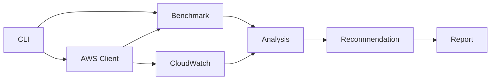

# LambdaOpt: SLO-aware cost optimizer for AWS Lambda

Find the cheapest AWS Lambda configuration that meets your p95/p99 latency SLO.

LambdaOpt is a production-oriented CLI for evaluating AWS Lambda performance, cost, and operational risk. It benchmarks candidate configurations, estimates Lambda cost, computes latency percentiles and SLO violation rate, analyzes CloudWatch production metrics, detects cold-start-driven tail latency from logs when available, and recommends safe next actions. It defaults to dry-run behavior and no production mutation.

## What LambdaOpt Does

- Benchmarks candidate configurations from local files or separate mapped test functions.
- Estimates Lambda request, compute, and provisioned concurrency cost.
- Computes mean, p50, p95, p99, standard deviation, and SLO violation rate.
- Detects cold-start-driven tail latency using CloudWatch Logs REPORT lines when available.
- Analyzes CloudWatch production metrics for duration, invocations, errors, throttles, and concurrency.
- Computes Pareto frontiers and recommends the cheapest SLO-satisfying configuration.
- Recommends safe next actions such as benchmarking, investigating throttles, testing arm64, or testing provisioned concurrency.
- Defaults to dry-run workflows and does not mutate production Lambda configuration.

## Architecture



The AWS layer is isolated from the optimizer. Benchmark data, CloudWatch metrics, and cold-start signals are converted into typed domain models before recommendation logic runs.

## Quickstart

Install from source:

```bash
git clone https://github.com/Mike-Animal-Counseling/aws-lambda-slo-optimizer.git
cd aws-lambda-slo-optimizer
python -m venv .venv
source .venv/bin/activate
python -m pip install -e ".[dev,aws,charts]"
```

Run a synthetic workload with no AWS credentials:

```bash
lambdaopt simulate --workload cpu-bound --p95 500 --monthly-requests 1000000 --output reports/cpu
```

Tune from local benchmark results:

```bash
lambdaopt tune --input examples/sample_results.json --p95 500 --monthly-requests 1000000 --output reports/sample
```

Plan a benchmark from read-only Lambda metadata:

```bash
lambdaopt plan my-function --p95 500 --region us-east-1 --profile default
```

Benchmark the currently deployed configuration:

```bash
lambdaopt bench my-function --trials 50 --payload examples/payload.json --region us-east-1 --output reports/bench-current
```

Analyze CloudWatch metrics and cold-start logs:

```bash
lambdaopt analyze my-function --window 24h --p95 500 --region us-east-1 --include-logs --output reports/analyze
```

Run a dry-run controller evaluation:

```bash
lambdaopt watch my-function --p95 500 --window 15m --dry-run --region us-east-1
```

## Sample Output

```text
Recommendation: 1024MB arm64 for p95 <= 500ms (90% confidence).
Reports written to reports/sample
```

Generated report files include:

- `optimization_report.md`
- `benchmark_results.json`
- `recommended_config.json`
- `cost_vs_p95.png` when matplotlib is installed and chart generation succeeds

## Safety

LambdaOpt is conservative by design:

- No production mutation by default.
- No current command changes `$LATEST`, published versions, production aliases, memory, architecture, or provisioned concurrency.
- Candidate comparison benchmarks separate test functions from an explicit mapping file.
- The watch controller is dry-run and emits recommended test actions, not direct infrastructure changes.
- Guardrails prioritize error and throttle investigation before cost optimization.
- Payload helpers redact likely sensitive keys such as `password`, `token`, `secret`, `authorization`, and `api_key`.
- AWS and validation errors are summarized for users; traceback is available with `--debug`.

Read more in [docs/safety.md](docs/safety.md).

## Lambda Power Tuning Comparison

AWS Lambda Power Tuning focuses on memory and power tradeoffs by running controlled benchmarks across Lambda memory sizes. LambdaOpt is complementary. It focuses on production SLO-constrained deployment recommendations using benchmark results, CloudWatch metrics, cold-start signals, cost estimates, and dry-run operational guardrails.

Use Lambda Power Tuning when you want a Step Functions-driven memory benchmark. Use LambdaOpt when you want a conservative recommendation workflow that asks whether a configuration satisfies p95/p99 latency goals at the lowest estimated cost and with acceptable operational risk.

## Documentation

- [Installation](docs/installation.md)
- [Usage](docs/usage.md)
- [Architecture](docs/architecture.md)
- [Design](docs/design.md)
- [Safety](docs/safety.md)
- [CloudWatch Analysis](docs/cloudwatch-analysis.md)
- [Cost Model](docs/cost-model.md)
- [Cold Start Analysis](docs/cold-start-analysis.md)
- [Dashboard](docs/dashboard.md)
- [Roadmap](docs/roadmap.md)

## Development

```bash
make install
make check
```

CI runs Ruff format check, Ruff lint, mypy, pytest, and package build.

## Status

LambdaOpt is pre-alpha. The local optimizer, simulator, report generation, read-only AWS metadata planning, current-config benchmarking, separate test-function candidate benchmarking, CloudWatch analysis, cold-start analysis, provisioned concurrency recommendation, architecture comparison, and dry-run controller are implemented and tested. Production mutation remains intentionally out of scope.

## Roadmap

Near-term milestones include safer alias-based benchmark workflows, richer SLO policy configuration, dashboard export, release automation, and more detailed pricing configuration. See [docs/roadmap.md](docs/roadmap.md).

## License

MIT. See [LICENSE](LICENSE).
