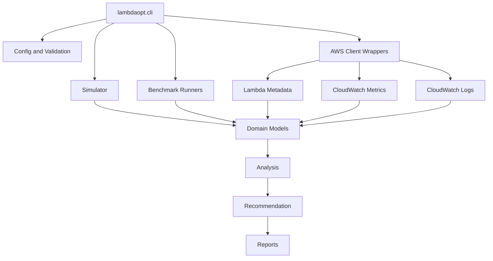

# Architecture

LambdaOpt is organized as a layered CLI application. The core optimizer works on typed local models, while AWS-specific code is kept behind small client wrappers.

## Layers

## Data Flow

1. The CLI parses options and loads optional `lambdaopt.yaml` configuration.
2. Input comes from one of several sources:
   - local benchmark JSON,
   - simulator output,
   - current Lambda invocation benchmarks,
   - separate candidate test functions,
   - read-only Lambda metadata,
   - CloudWatch metrics,
   - CloudWatch Logs REPORT lines.
3. Input is converted into Pydantic models such as `LambdaConfig`, `BenchmarkResult`, `LatencyStats`, `CostEstimate`, and `AnalyzedConfig`.
4. Analysis modules compute latency statistics, cost estimates, Pareto status, CloudWatch health, and cold-start signals.
5. Recommendation modules emit conservative recommendations.
6. Report modules write Markdown, JSON, and optional charts.

## Module Boundaries

- `lambdaopt.aws`: boto3 wrapper code for Lambda, CloudWatch, and Logs.
- `lambdaopt.benchmark`: invocation and candidate benchmark orchestration.
- `lambdaopt.analysis`: latency, cost, Pareto, CloudWatch, and cold-start analysis.
- `lambdaopt.recommend`: SLO, architecture, provisioned concurrency, and controller recommendations.
- `lambdaopt.report`: Markdown, JSON, and chart output.
- `lambdaopt.simulator`: deterministic synthetic workloads for demos and tests.

## Safety Boundary

AWS wrappers currently read metadata, read metrics/logs, or invoke named functions. They do not update function configuration. Candidate comparison uses separate mapped test functions instead of changing the production function.

## Report Outputs

The local optimization workflow writes:

- `benchmark_results.json`
- `recommended_config.json`
- `optimization_report.md`
- `cost_vs_p95.png` when matplotlib is available

CloudWatch analysis writes:

- `cloudwatch_analysis.json`
- a Markdown CloudWatch analysis report
